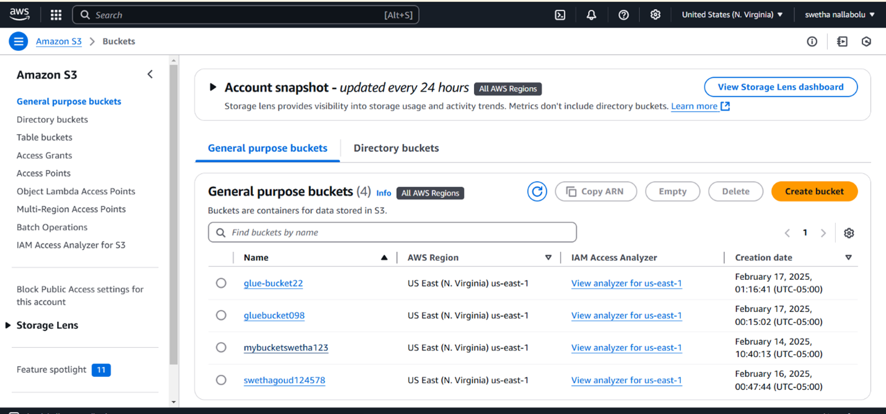

# AWS_DEMO1
## AWS IAM (Identity and Access Management)
AWS IAM is a security service that enables organizations to manage user access to AWS resources securely. It helps define **who** can access **what** AWS resources and under **what conditions**.
